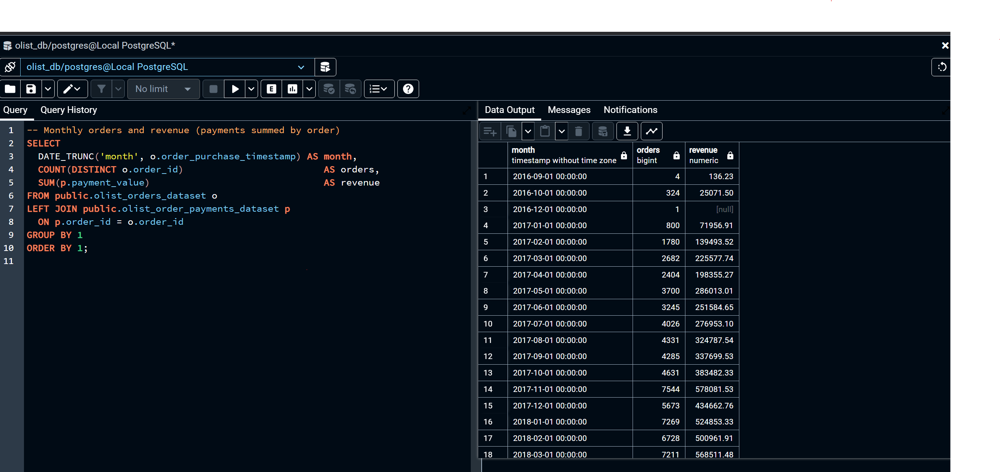

# 📊 Ecommerce SQL Analytics - Olist  

SQL analytics project on the Brazilian e-commerce **Olist dataset**.  
Includes queries to analyze **orders, customers, products, payments, and reviews**.  
Covers KPIs (orders, revenue, delivery), **marketing funnel analysis**, **RFM segmentation**, and **cohort retention**.  

## 1. Monthly Orders & Revenue

---

## 2. Average Delivery Time by Month (Delivered Orders Only)
.png)

---

## 3. On-time vs Late Delivery by Month

---

## 4. Orders & Revenue by State

---

## 5. Average Order Value (AOV) by State
%20by%20State.png)

---

## 6. Payment Method Mix (Volume & Revenue)
.png)

---

## 📂 Project Structure  

- `data/` → CSV datasets (customers, orders, payments, products, reviews)  
- `sql/queries.sql` → SQL queries for KPIs & analytics  
- `README.md` → Project overview and documentation  

---

## 🛠 Stack  

- **SQL** (Postgres / DuckDB compatible)  
- **Excel/CSV** (raw datasets from Kaggle Olist)  
- **GitHub** (version control, portfolio hosting)  

---

## 📊 Preview Highlights  

- Orders & unique customers by month  
- Payment trends and revenue breakdown  
- Top product categories by sales volume  
- Review scores distribution  
- Funnel conversion (orders → delivery → review)  

---

## 🔑 Key Findings  

- 📉 High delivery delays impact customer satisfaction  
- 🛍️ Electronics and furniture are top churn-risk categories  
- 💳 Credit card payments dominate, but boleto has higher late payments  
- ⭐ 1–2 star reviews strongly correlate with delayed shipments 
